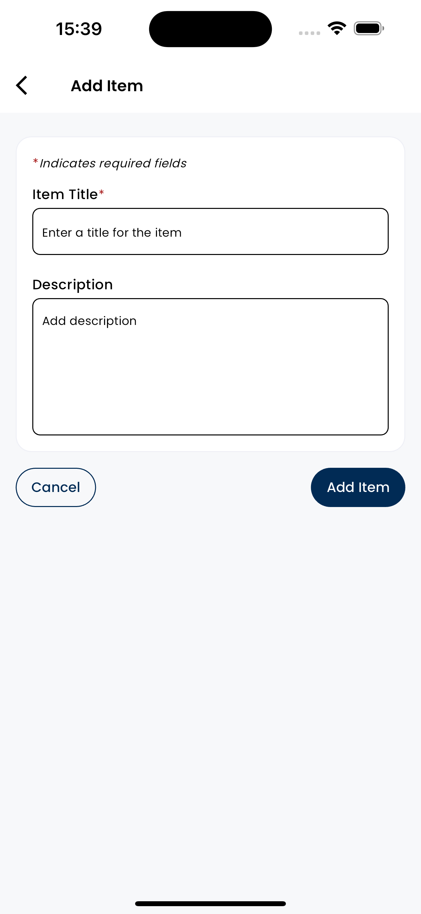

# technoprise_test


Steps to run this project 

1. Clone the repository to your local machine.
2. Install the packages required by running: 
 ```bash
flutter pub get 
```

3. The project uses riverpod generate to generate the provider files,
Run the following command to generate the provider files.. also the same command will generate the key files (Using riveprod for state management)


```bash
dart run build_runner build 
```

4. Then you can build the project using the following command
 
```bash
 flutter run 
```

Screenshots





